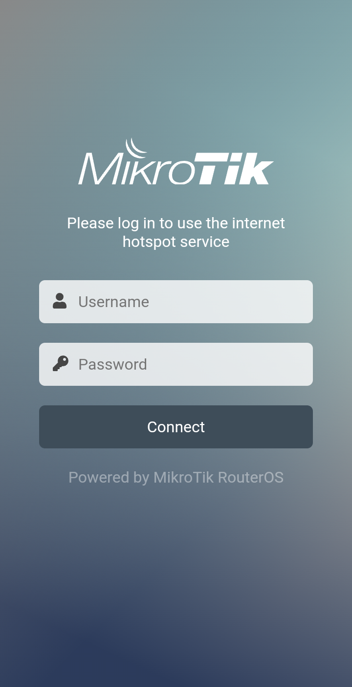

---

### 📜 **README.md**

# 🎛️ MikroTik Captive Portal Template - Uvatis  

This repository contains a **responsive captive portal template** for **MikroTik routers**, designed for seamless user authentication and Wi-Fi access control. The template is customizable and compatible with MikroTik's built-in hotspot system.  

## 📸 Preview  

  

## 🚀 Features  

✅ Modern and responsive design  
✅ Customizable login page  
✅ MikroTik hotspot compatibility  
✅ Supports username/password or voucher-based authentication  

## 📥 Installation  

1. **Download the template**:  
   ```sh
   git clone https://github.com/Uvatis/mikrotik-captive-portal.git
   cd mikrotik-captive-portal
   ```

2. **Upload the files** to the MikroTik router (`hotspot` directory) via FTP, Winbox, or SCP.

3. **Set the portal path** in the MikroTik terminal:
   ```sh
   /ip hotspot profile set [profile-name] html-directory=mikrotik-captive-portal
   ```

4. Restart the hotspot service:
   ```sh
   /ip hotspot disable [hotspot-name]
   /ip hotspot enable [hotspot-name]
   ```

5. The captive portal should now be active.

## 🛠️ Customization

- Modify `login.html` to customize the design and branding.
- Edit `login.css` for style adjustments.
- Adapt `login.js` to implement custom authentication logic.

## 📄 License

This project is licensed under the **MIT** license.

---

## 🇫🇷 Template de portail captif MikroTik - Uvatis

Ce dépôt contient un **template de portail captif moderne et responsive** pour les **routeurs MikroTik**, conçu pour une authentification fluide des utilisateurs et un contrôle d’accès Wi-Fi. Il est personnalisable et compatible avec le système hotspot intégré de MikroTik.

## 📸 Aperçu


## 🚀 Fonctionnalités

✅ Design moderne et responsive  
✅ Page de connexion personnalisable  
✅ Compatible avec le hotspot MikroTik  
✅ Prise en charge de l’authentification par identifiant/mot de passe ou via des tickets

## 📥 Installation

1. **Télécharger le template** :
   ```sh
   git clone https://github.com/Uvatis/mikrotik-captive-portal.git
   cd mikrotik-captive-portal
   ```

2. **Transférer les fichiers** sur le routeur MikroTik (dossier `hotspot`) via FTP, Winbox ou SCP.

3. **Définir le chemin du portail** dans le terminal MikroTik :
   ```sh
   /ip hotspot profile set [nom-du-profil] html-directory=mikrotik-captive-portal
   ```

4. Redémarrer le service hotspot :
   ```sh
   /ip hotspot disable [nom-du-hotspot]
   /ip hotspot enable [nom-du-hotspot]
   ```

5. Le portail captif est maintenant actif.

## 🛠️ Personnalisation

- Modifier `login.html` pour personnaliser le design et le branding.
- Éditer `login.css` pour ajuster le style.
- Adapter `login.js` pour ajouter une logique d’authentification spécifique.

## 📄 Licence

Ce projet est sous licence **MIT**.

